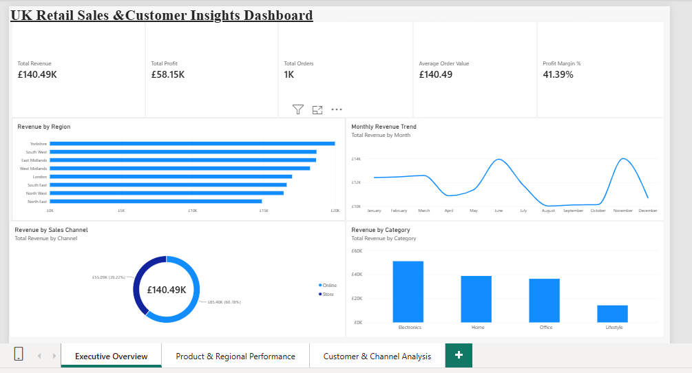
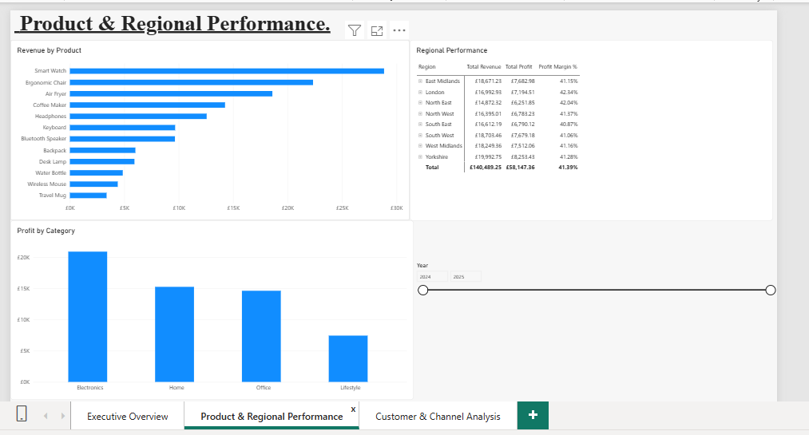
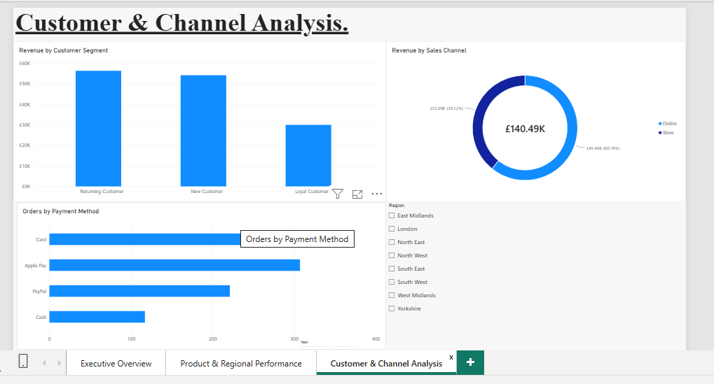

# UK Retail Sales & Customer Insights Dashboard

## About the Project

I created this Power BI project to explore retail sales data and understand how the business is performing across different products, regions, customer groups and sales channels.

The dataset contains 1,000 retail transactions across 2024 and 2025. I used Power Query to prepare the data and created DAX measures for key business metrics such as revenue, profit, total orders, average order value and profit margin.

I designed the report across three pages so that the information is easy to explore without putting everything into one dashboard.

## Dashboard Pages

### 1. Executive Overview

This page gives a quick view of overall business performance, including revenue, profit, total orders, average order value and profit margin. It also shows monthly revenue trends and performance across regions, categories and sales channels.

### 2. Product & Regional Performance

This page focuses on how different products and categories are performing. It also includes a regional view to compare revenue, profit and profit margin across different locations.

### 3. Customer & Channel Analysis

This page looks at customer segments, payment methods and sales channels. I also added Year and Region filters so the report can be explored interactively.

## Key Measures

I created DAX measures for:

- Total Revenue
- Total Profit
- Total Orders
- Average Order Value
- Profit Margin %
- Units Sold

## Tools Used

- Power BI
- Power Query
- DAX
- Microsoft Excel
- Data Cleaning
- Data Visualisation
- KPI Reporting

## Dataset

This project uses a synthetic retail dataset created for learning and portfolio purposes. It does not contain confidential or real company information.

## What I Learned

This project helped me improve my understanding of preparing data in Power Query, creating DAX measures and turning transactional data into a dashboard that is easy to understand. It also gave me practical experience in choosing visuals based on the type of business question being analysed.
